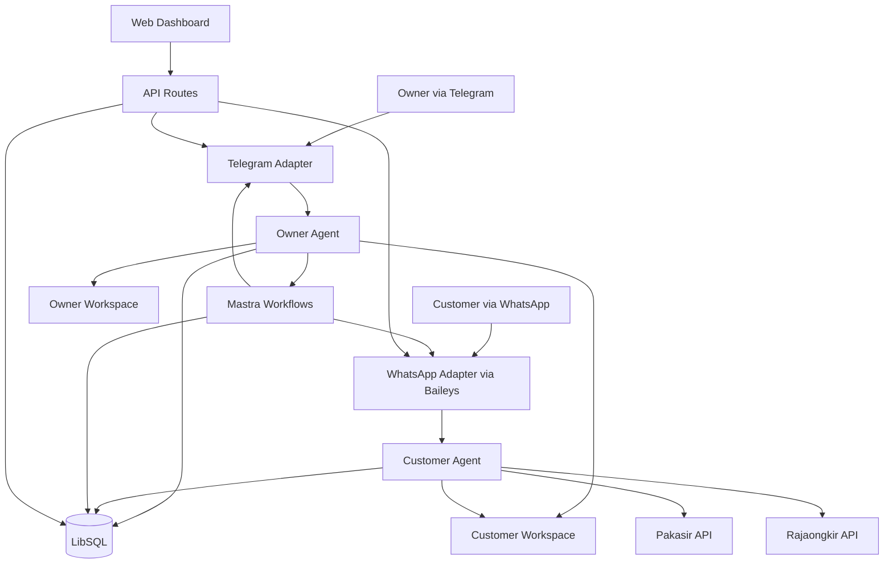

# Juragan v1.0 - System Architecture

## Document Status

- Status: Planning
- Purpose: source of truth untuk desain teknis Juragan v1.0
- Audience: founder, engineer, product owner
- Scope: arsitektur sistem, batas akses agent, komponen utama, data model, dan flow runtime

## Architecture Goals

Juragan dibangun sebagai platform agent bisnis untuk owner usaha di Indonesia. Pada v1.0, fokus arsitektur adalah:

1. Memisahkan dengan tegas peran antara Owner Agent dan Customer Agent.
2. Menjaga isolasi data agar Customer Agent tidak bisa mengakses data privat owner.
3. Memungkinkan autopilot customer support via WhatsApp tanpa menghilangkan kontrol owner.
4. Menyediakan jalur approval, override, dan observability untuk owner via Telegram dan dashboard.
5. Memakai komponen runtime yang realistis untuk self-hosted product: Mastra, LibSQL, Baileys, dan service integration yang sederhana.

## System Overview

### Core Runtime

Juragan v1.0 terdiri dari dua agent utama yang berjalan di atas satu backend:

- `juragan-owner`
  - Channel utama: Telegram
  - Peran: command center untuk owner
  - Akses: full CRUD seluruh data bisnis dan semua data customer
  - Memori: aktif, dengan short-term memory dan proses dreaming

- `juragan-customer`
  - Channel utama: WhatsApp via Baileys
  - Peran: customer support, order intake, payment, shipping inquiry
  - Akses: terbatas pada workspace customer dan tool customer
  - Memori: stateless untuk meminimalkan risiko kebocoran data

### High-Level Diagram



## Agent Responsibilities

### Owner Agent

Owner Agent adalah master agent. Semua keputusan bisnis penting berpusat di sini.

Tanggung jawab utama:

- membaca dan menulis semua data bisnis
- mengelola produk, transaksi, invoice, kontak, dan reminder
- melihat order dan conversation customer
- enable atau disable Customer Agent
- menyetujui atau menolak workflow yang butuh human approval
- menjalankan skill owner
- menghasilkan dokumen bisnis, proposal, laporan, dan brand assets

Hak akses:

- read/write seluruh tabel bisnis
- read seluruh data customer
- read/write owner workspace
- read customer workspace
- memicu workflow dan melanjutkan workflow yang tersuspend

### Customer Agent

Customer Agent adalah sub-agent operasional untuk customer-facing flow.

Tanggung jawab utama:

- menjawab pertanyaan produk via WhatsApp
- membuat order
- menghitung ongkir
- membuat permintaan pembayaran
- mengecek status pembayaran dan pengiriman
- mencatat percakapan customer
- mengeskalasi ke owner jika ada kondisi yang tidak aman untuk diproses otomatis

Batas akses:

- hanya boleh memakai tool customer
- hanya boleh read/write customer workspace
- tidak boleh membaca file, memory, atau data privat owner

## Workspace Isolation

### Directory Layout

```text
data/workspaces/{tenantId}/
|-- owner/
|   |-- files/
|   |   |-- contracts/
|   |   |-- catalogs/
|   |   `-- documents/
|   |-- skills/
|   |   |-- daily-checkin/
|   |   |-- customer-followup/
|   |   |-- price-calculation/
|   |   |-- stock-opname/
|   |   |-- supplier-order/
|   |   |-- wa-blast/
|   |   |-- invoice-reminder/
|   |   `-- expense-claim/
|   |-- design-system/
|   |-- MEMORY.md
|   `-- .juragan/
`-- customer/
    |-- conversations/
    |   |-- +62812xxxxxxx/
    |   |   `-- chat_history.md
    |   `-- +62813xxxxxxx/
    |       `-- chat_history.md
    |-- templates/
    |-- files/
    `-- .juragan/
```

### Access Matrix

| Resource | Owner Agent | Customer Agent |
|----------|-------------|----------------|
| `owner/` workspace | Full access | No access |
| `customer/` workspace | Full access | Full access |
| Orders | Read/write | Read/write only through approved customer tools |
| Conversations | Read/write | Read/write |
| Notes, transactions, invoices | Read/write | No access |
| Memory | Read/write | No access |
| Agent settings | Read/write | Read-only if needed for guard check |

### Non-Negotiable Rules

1. Customer Agent tidak boleh membaca `owner/`.
2. Owner Agent boleh membaca `owner/` dan `customer/`.
3. Semua tool customer harus didesain seolah-olah berjalan di lingkungan least-privilege.
4. Logging, audit trail, dan order status history harus selalu bisa dibaca oleh Owner Agent.

## Backend Structure

Struktur source code target untuk `apps/api/src/`:

```text
apps/api/src/
|-- bootstrap.ts
|-- db/
|   |-- client.ts
|   |-- schema.ts
|   `-- settings.ts
|-- channels/
|   |-- telegram.ts
|   `-- whatsapp.ts
|-- agents/
|   |-- owner/
|   |   |-- index.ts
|   |   |-- supervisor.ts
|   |   `-- commands.ts
|   `-- customer/
|       `-- index.ts
|-- tools/
|   |-- owner/
|   `-- customer/
|-- workflows/
|   |-- order-approval.ts
|   |-- restock.ts
|   `-- customer-followup.ts
|-- workspaces/
|   |-- owner.ts
|   `-- customer.ts
|-- memory/
|   `-- dreaming.ts
|-- services/
|   |-- pakasir.ts
|   `-- rajaongkir.ts
|-- documents/
|   `-- generator.ts
|-- design/
|   `-- brand-generator.ts
|-- mastra/
|   |-- index.ts
|   `-- api-routes.ts
`-- reminders/
    `-- executor.ts
```

## Core Components

### Channel Layer

- Telegram adapter
  - menerima command dan pesan owner
  - mengirim notifikasi order, alert, dan approval request

- WhatsApp adapter
  - memakai Baileys
  - mengelola pairing QR, auth state, reconnect, inbound message, outbound message, dan media

### Agent Layer

- Owner Agent
  - pusat orchestration
  - tool-rich
  - mampu memanggil sub-agent owner jika memang dibutuhkan untuk pemisahan concern internal

- Customer Agent
  - prompt lebih ketat
  - fokus pada deterministic business flows
  - wajib check guard conditions seperti enable/disable, stock, payment state, dan escalation rule

### Service Layer

- Pakasir client
  - create transaction
  - cancel transaction
  - webhook verification

- Rajaongkir client
  - provinces
  - cities
  - shipping cost
  - tracking atau waybill jika dipakai

### Persistence Layer

- LibSQL sebagai primary relational store
- workspace file system untuk artifacts, chat history, generated documents, dan design outputs
- Mastra storage untuk workflow persistence

## Database Architecture

### Existing Tables

- `notes`
- `transactions`
- `reminders`
- `products`
- `stock_movements`
- `contacts`
- `invoices`
- `settings`
- `scheduled_prompts`

### New Tables for v1.0

| Table | Purpose |
|-------|---------|
| `agent_settings` | status Customer Agent, model config, channel config, toggle flags |
| `orders` | order customer dari WhatsApp |
| `order_status_history` | audit perubahan status order |
| `conversations` | log pesan inbound dan outbound |
| `payments` | status pembayaran Pakasir dan metadata QRIS atau VA |
| `shipping_costs` | cache ongkir Rajaongkir |
| `expense_categories` | kategori pengeluaran |
| `memory` | semantic memory owner |
| `memory_recalls` | recall tracking untuk memory |
| `tool_approvals` | approval queue untuk tool atau action sensitif |
| `auto_reply_rules` | keyword rules, business hours, vacation mode |

### Ownership Notes

- `orders`, `conversations`, `payments`, dan `shipping_costs` adalah shared business data.
- `memory` dan `memory_recalls` adalah owner-only domain.
- `agent_settings` harus diperlakukan sebagai data sistem, bukan data customer.

## Agent Configuration

### Owner Agent

Konfigurasi konseptual:

```ts
export const ownerAgent = new Agent({
  id: "juragan-owner",
  name: "Juragan Owner",
  description: "Owner business assistant with full business visibility",
  model: "openrouter/anthropic/claude-sonnet-4-6",
  instructions: ownerInstructions,
  tools: {
    // existing owner tools
    addNote,
    listNotes,
    logTransaction,
    getDailySummary,
    setReminder,
    listReminders,
    addProduct,
    listProducts,
    adjustStock,
    addContact,
    listContacts,
    createInvoice,
    listInvoices,
    markInvoicePaid,
    schedulePrompt,
    listScheduledPrompts,
    cancelScheduledPrompt,
    getCurrentTime,

    // v1 additions
    cashflowReport,
    addExpenseCategory,
    listExpenseCategories,
    searchContacts,
    stockMovements,
    memorySearch,
    memoryRead,
    customerOrders,
    customerConversations,
    customerAgentCtl,
    generateDocument,
    generateProposal,
    generatePitchDeck,
    generateChartData,
    generateBrandGuideline,
    generateCssSystem,
    generateBrandHtml,

    // workspace
    listFiles,
    readFile,
    writeFile,
    grep,
  },
  workspace: ownerWorkspace,
  memory: new Memory({
    options: { lastMessages: 20 },
  }),
  channels: {
    adapters: {
      telegram: createTelegramAdapter(),
    },
  },
});
```

### Customer Agent

Konfigurasi konseptual:

```ts
export const customerAgent = new Agent({
  id: "juragan-customer",
  name: "Juragan Customer",
  description: "WhatsApp customer support and order assistant",
  model: "openrouter/anthropic/claude-sonnet-4-6",
  instructions: customerInstructions,
  tools: {
    listProducts,
    createOrder,
    checkOrder,
    requestPayment,
    checkPayment,
    calculateShipping,
    trackShipping,
    requestShipping,
    invoiceOrder,
    requestCancel,
    trackDelivery,
  },
  workspace: customerWorkspace,
  memory: undefined,
  channels: {
    adapters: {
      whatsapp: createWhatsAppAdapter(),
    },
  },
});
```

## Order and Support Flow

### Customer Order Flow

```text
Customer chat in WhatsApp
-> WhatsApp adapter receives message
-> system checks Customer Agent status
-> Customer Agent interprets request
-> product lookup / shipping / payment tools run
-> order is stored in DB
-> payment webhook updates status
-> owner is notified if approval is needed
-> customer receives final status update
```

### Enable or Disable Flow

```text
Owner runs /customer-agent disable
-> Owner Agent updates agent_settings.customer_agent_enabled = false
-> WhatsApp inbound handler switches to offline reply mode
-> customer receives offline message only

Owner runs /customer-agent enable
-> Owner Agent updates agent_settings.customer_agent_enabled = true
-> WhatsApp inbound handler resumes normal agent dispatch
```

## Workflow Architecture

Juragan memakai Mastra native workflow. Tidak ada rencana memakai custom task registry ala OpenClaw.

### Why Mastra Native

- durable state sudah tersedia
- suspend atau resume cocok untuk approval owner
- state antar langkah bisa dibagikan tanpa invent framework tambahan
- lebih sederhana untuk v1 dan lebih mudah di-maintain

### Workflow Types in v1

| Workflow | Trigger | Human approval |
|----------|---------|----------------|
| `order-approval` | order customer perlu approval | ya |
| `restock` | stok rendah atau owner minta restock | ya |
| `customer-followup` | invoice overdue atau reminder | opsional |

### Workflow Pattern

```ts
export const restockWorkflow = createWorkflow({
  id: "restock",
  inputSchema,
  outputSchema,
})
  .then(checkStockStep)
  .then(draftPoStep)
  .then(confirmSupplierStep)
  .commit();
```

Jika suatu langkah butuh owner approval:

```ts
return suspend({
  details: "Draft PO siap. Menunggu approval owner.",
});
```

Lalu owner melanjutkan via Telegram:

```ts
await run.resume({
  step: "draft-po",
  resumeData: { approved: true },
});
```

## Model Routing

Juragan mendukung model router dinamis. Agent tidak perlu direcreate hanya untuk ganti provider.

### Supported Target Providers

| Provider | Example model |
|----------|---------------|
| OpenRouter | `openrouter/anthropic/claude-sonnet-4-6` |
| Anthropic | `anthropic/claude-sonnet-4-6` |
| OpenAI | `openai/gpt-4o` |
| Google | `google/gemini-2.5-pro` |

### Design Rule

- model aktif disimpan di `agent_settings.model_config`
- command `/model` hanya mengubah config runtime
- fallback default tetap OpenRouter agar deployment sederhana

## Reliability and Guardrails

### Required Guard Checks

Sebelum Customer Agent melakukan action penting, sistem wajib memeriksa:

1. Customer Agent enabled atau disabled
2. stock cukup atau tidak
3. payment state valid atau belum
4. order state masih mengizinkan action
5. action perlu approval owner atau tidak

### Failure Handling

- WhatsApp disconnect: retry reconnect, notify owner, fallback ke QR rescan jika gagal berkali-kali
- Pakasir timeout: balas error yang jelas ke customer, jangan create status order yang misleading
- QR expired: tandai payment expired dan tawarkan generate ulang
- oversell prevention: jangan generate pembayaran jika stok tidak cukup

## Security and Privacy Decisions

1. Customer Agent stateless by default.
2. Memory hanya untuk owner domain.
3. Semua outbound automation yang sensitif harus bisa diaudit.
4. Generated documents dan design assets disimpan per tenant.
5. Customer conversation history harus mudah diinspeksi owner tanpa membuka akses owner ke customer.

## v1 Non-Goals

Fitur berikut bukan prioritas inti arsitektur v1 meskipun mungkin muncul di backlog:

- multi-warehouse inventory
- automated refund via payment gateway
- omnichannel selain Telegram dan WhatsApp
- advanced vector search infra untuk memory
- fully autonomous procurement tanpa approval owner

## Architecture Readiness Checklist

- [ ] Dua agent terdaftar di Mastra dan tidak saling melanggar boundary akses
- [ ] WhatsApp adapter mendukung QR pairing, reconnect, inbound, outbound
- [ ] Telegram adapter siap untuk command dan approval
- [ ] DB schema memuat semua tabel inti v1
- [ ] workflow persistence aktif
- [ ] owner dapat melihat seluruh data customer
- [ ] customer tidak dapat mengakses data owner
